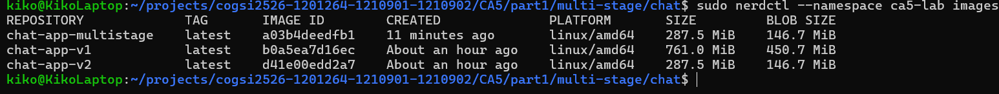
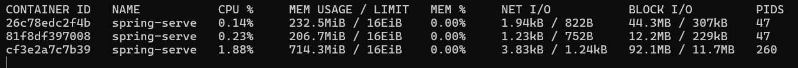
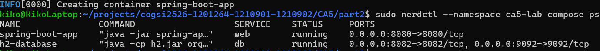
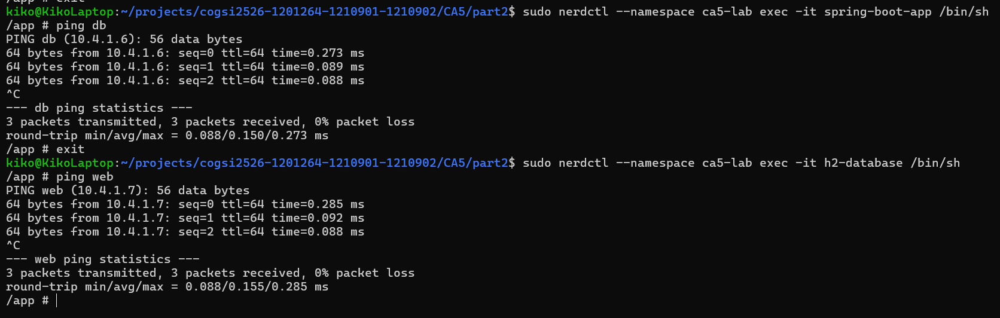
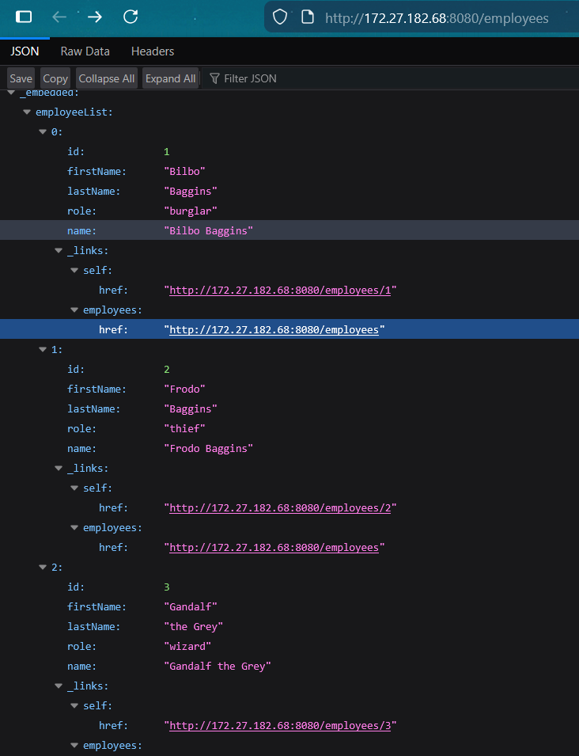
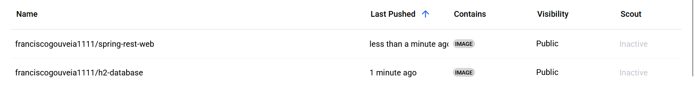

# CA5 - Containers

## Table of Contents
1. [Creating and Managing Docker Images](#creating-and-managing-docker-images)
   1. [Setting Up Docker](#setting-up-docker)
   2. [Packaging Applications into Docker Containers](#packaging-applications-into-docker-containers)
   3. [Creating Docker Images: Two Approaches](#creating-docker-images-two-approaches)
   4. [Understanding Docker Image Layers and Monitoring](#understanding-docker-image-layers-and-monitoring)
   5. [Publishing](#publishing)
   6. [Optimize the Dockerfiles](#optimize-the-dockerfiles)
2. [Containerized Environment with Docker Compose](#containerized-environment-with-docker-compose)
   1. [Overview of Docker Compose](#overview-of-docker-compose)
   2. [Setting Up Containers](#setting-up-containers)
   3. [Testing Container Networking and Health Checks](#testing-container-networking-and-health-checks)
   4. [Data Persistence with Docker Volumes](#data-persistence-with-docker-volumes)
   5. [Publishing](#publishing)
3. [Useful Docker and Docker Compose Commands](#useful-docker-and-docker-compose-commands)


## Creating and Managing Docker Images
Nesta secção, exploraremos o processo de criação e gestão de imagens Docker para aplicações. As imagens Docker são os blocos de construção dos contentores, proporcionando um ambiente leve, portátil e consistente para a execução de aplicações.

As etapas a seguir descrevem a implementação da solução:
### Setting Up Docker

1. Update aos packages:
```
sudo apt update
sudo apt upgrade -y
```
2. Instalar as dependências:
```
sudo apt install -y apt-transport-https ca-certificates curl software-properties-common
```
3. Adicionar a Docker GPG key:
```
curl -fsSL https://download.docker.com/linux/ubuntu/gpg | sudo gpg --dearmor -o /usr/share/keyrings/docker-archive-keyring.gpg
```
4. Instalar o Docker:
```
sudo apt update
sudo apt install -y docker-ce docker-ce-cli containerd.io
```
5. Verificar a instalação:
```
docker --version
```


### Packaging Applications into Docker Containers
Para dockerizar a aplicação de chat e a API Spring REST, precisamos criar imagens Docker para cada aplicação. As imagens Docker conterão as dependências, configurações e código de aplicação necessários para executar as aplicações em contentores.

#### Chat Application Dockerfile
Dentro da pasta CA5, onde está localizado o código do aplicação chat, crio um Dockerfile com o seguinte conteúdo:
```Dockerfile
FROM amazoncorretto:17-alpine

WORKDIR /app

# Install Git and Gradle
RUN apk add --no-cache git gradle

# Clone the repository
RUN git clone https://github.com/pedroteixeira80/cogsi2526-1201264-1210901-1210902.git /app

WORKDIR /app/CA2-part1/gradle_basic_demo-main

# Build the application
RUN gradle build -x test --no-daemon

# Run the chat server
CMD ["java", "-cp", "build/libs/basic_demo-0.1.0.jar", "basic_demo.ChatServerApp", "59001"]
```
Este ficheiro define as etapas para criar uma imagem Docker para a aplicação de chat:
- **FROM**: Especifica a imagem base a ser usada, neste caso, a imagem oficial openjdk:17-jdk-slim.
- **WORKDIR**: Define o diretório de trabalho dentro do contentor onde o código do aplicativo será copiado.
- **COPY**: Copia o arquivo JAR compilado do projeto para o diretório de trabalho do contentor. Certifique-se de compilar o arquivo JAR antes de criar a imagem Docker. Para isso, execute `./gradlew build` na pasta da aplicação chat.
- **CMD**: Define o comando para executar o servidor de chat quando o contentor é iniciado. O comando especifica o classpath e a classe principal para executar o ChatServerApp na porta 59001.


#### Spring REST API Dockerfile
Dentro da pasta CA5, onde está localizado o código da API REST do Spring, crio um Dockerfile com o seguinte conteúdo:
```Dockerfile
FROM amazoncorretto:17-alpine

WORKDIR /app

# Install Git and Gradle
RUN apk add --no-cache git gradle

# Clone the repository
RUN git clone https://github.com/pedroteixeira80/cogsi2526-1201264-1210901-1210902.git /app

# Navigate to the SPRING application directory
WORKDIR /app/CA2-part2/tut-gradle

# Build the Spring Boot application
RUN gradle build -x test --no-daemon

EXPOSE 8080

# Run the Spring Boot application
ENTRYPOINT ["gradle", "bootRun", "--no-daemon"]
```
Este ficheiro define as etapas para criar uma imagem Docker para a aplicação chat:
- **FROM**: Especifica a imagem base a ser usada, neste caso, a imagem oficial openjdk:17-jdk-slim.
- **WORKDIR**: Define o diretório de trabalho dentro do contentor onde o código da aplicação será copiado.
- **COPY**: Copia o arquivo JAR compilado do projeto para o diretório de trabalho do contentor. Certifico-me de compilar o arquivo JAR antes de criar a imagem Docker. Para isso, executo `./gradlew build` na pasta do aplicativo Spring.
- **EXPOSE**: expõe a porta 8080 para a aplicação Spring Boot escutar.
- **ENTRYPOINT**: define o comando para executar a aplicação Spring Boot quando o contentor é iniciado.

### Creating Docker Images: Two Approaches

#### Version 1: Building the Server Inside the Dockerfile

##### Chat Application
Para criar a imagem Docker da aplicação chat, crio outro ficheiro Dockerfile numa pasta à escolha com o seguinte conteúdo:
```Dockerfile
# Stage 1: Build the application
FROM amazoncorretto:17-alpine AS builder

WORKDIR /app

# Install Git and Gradle
RUN apk add --no-cache git gradle

# Clone the repository
RUN git clone https://github.com/pedroteixeira80/cogsi2526-1201264-1210901-1210902.git /app

# Navigate to the chat application directory
WORKDIR /app/CA2-part1/gradle_basic_demo-main

# Build the application
RUN gradle build -x test --no-daemon

# Stage 2: Runtime image
FROM amazoncorretto:17-alpine

WORKDIR /app

# Copy ONLY the JAR from the build stage
COPY --from=builder /app/CA2-part1/gradle_basic_demo-main/build/libs/basic_demo-0.1.0.jar /app/basic_demo-0.1.0.jar

# Run the chat server
CMD ["java", "-cp", "basic_demo-0.1.0.jar", "basic_demo.ChatServerApp", "59001"]
```
Este Dockerfile reutiliza o Dockerfile anterior para a aplicação chat, mas adiciona um processo de compilação em várias etapas para clonar o código da aplicação a partir de um repositório GitHub. O processo de compilação é dividido em duas etapas:
- **Etapa 1 (compilador)**: Clona o repositório, compila a aplicação usando Gradle e verifica a criação do ficheiro JAR.
- O comando git clone procura o repositório.
- O comando de compilação Gradle compila o aplicativo e cria o ficheiro JAR.
- O comando ls lista o conteúdo do diretório build/libs para verificar o ficheiro JAR.
- **Etapa 2**: Utiliza o tempo de execução oficial do OpenJDK como imagem base e copia o ficheiro JAR compilado da fase de compilação para a imagem final. A instrução CMD especifica o comando para executar o servidor de chat.

##### Spring REST API
Para criar a imagem Docker da API REST do Spring, crie outro ficheiro Dockerfile numa pasta à sua escolha com o seguinte conteúdo:
```Dockerfile
# Stage 1: Build the application
FROM amazoncorretto:17-alpine AS builder

WORKDIR /app

# Install Git and Gradle
RUN apk add --no-cache git gradle

# Clone the repository
RUN git clone https://github.com/pedroteixeira80/cogsi2526-1201264-1210901-1210902.git /app

# Navigate to the Spring application directory
WORKDIR /app/CA2-part2/tut-gradle

# Build the application
RUN gradle build -x test --no-daemon

# Stage 2: Runtime image
FROM amazoncorretto:17-alpine

WORKDIR /app

# Copy ONLY the JAR from the build stage
COPY --from=builder /app/CA2-part2/tut-gradle/build/libs/*.jar /app/spring-app.jar

EXPOSE 8080

# Run the Spring Boot application
ENTRYPOINT ["java", "-jar", "spring-app.jar"]
```
Este Dockerfile reutiliza o Dockerfile anterior para a API REST do Spring, mas adiciona um processo de compilação em várias etapas para clonar o código da aplicação a partir de um repositório GitHub. O processo de compilação é dividido em duas etapas:
- **Etapa 1 (compilador)**: Clona o repositório, compila a aplicação usando Gradle e verifica a criação do ficheiro JAR.
- O comando git clone procura o repositório.
- O comando de compilação Gradle compila a aplicação e cria o ficheiro JAR.
- **Etapa 2**: Utiliza o tempo de execução oficial do OpenJDK como imagem base e copia o ficheiro JAR compilado da fase de compilação para a imagem final. A instrução EXPOSE expõe a porta 8080 para a aplicação Spring Boot, e a instrução ENTRYPOINT especifica o comando para executar a aplicação Spring Boot.

#### Version 2: Building the Server on the Host and Copying the JAR
A segunda abordagem envolve compilar a aplicação na máquina anfitriã e copiar o ficheiro JAR para a imagem Docker.
Esta solução é apresentada na secção anterior [Packaging Applications into Docker Containers](#packaging-applications-into-docker-containers), onde os ficheiros Dockerfiles criados para a aplicação de chat e a API Spring REST copiam os ficheiros JAR compilados para o contentor.


### Understanding Docker Image Layers and Monitoring
As imagens do Docker são compostas por várias camadas, cada uma representando um conjunto específico de alterações ou instruções na imagem. Compreender as camadas da imagem do Docker é essencial para otimizar o tamanho da imagem, a velocidade de compilação e a eficiência do cache.
Ao compilar imagens do Docker, cada instrução no Dockerfile cria uma nova camada na imagem. As camadas são somente de leitura e podem ser partilhadas entre várias imagens, reduzindo o uso de espaço em disco e melhorando o desempenho da compilação.
Para monitorizar as camadas da imagem Docker e inspecionar o conteúdo de uma imagem, pode-se usar os seguintes comandos:
- `docker history <nome_da_imagem>:<tag_da_imagem>`: exibe o histórico de uma imagem, mostrando as camadas e os comandos usados para compilar a imagem.
  - Por exemplo, `docker history chat-v1` resulta em:
  ```
    IMAGE          CREATED BY                                      SIZE 
    0c4f3b3b4b5d   /bin/sh -c #(nop)  CMD ["java" "-cp" "/app/...   0B
    1e3b3b4b5d4e   /bin/sh -c #(nop) COPY file:8d7b3b4b5d4e1...   45.8MB
    2e3b3b4b5d4e   /bin/sh -c #(nop) WORKDIR /app                  0B
    3e3b3b4b5d4e   /bin/sh -c #(nop)  EXPOSE 59001                 0B
    4e3b3b4b5d4e   /bin/sh -c #(nop)  CMD ["java" "-cp" "/app/...   0B
   ```
- `docker stats <container_name_or_id>` : Exibe o uso de recursos em tempo real de um contentor em execução.
  - e.g., `docker stats chat-server-v1`, resulta em:
  ``` 
    CONTAINER ID   NAME           CPU %     MEM USAGE / LIMIT     MEM %     NET I/O       BLOCK I/O   PIDS
    1e3b3b4b5d4e   chat-server-v1  0.00%    0B / 0B               0.00%    0B / 0B      0B / 0B    0
   ```
  

### Publishing and Running Docker Images
#### Build a Docker image
`docker build -t <nome_da_imagem>:<tag_da_imagem> .`

`docker build`: este comando é usado para criar uma imagem Docker 
a partir de um Dockerfile (o ficheiro que contém instruções para criar a imagem).

`<nome_da_imagem>`:  é o nome da imagem.

`<image_tag>`: é a tag/versão da imagem. Isso ajuda a distinguir entre diferentes versões da mesma imagem.

`.`: (ponto) Refere-se ao diretório atual e indica ao Docker para usar o Dockerfile nesse diretório para construir a imagem.

#### Run a container

##### Chat
`docker run -p 59001:59001 <chat_image>:<chat_tag>`

`docker run`: Este comando é usado para executar um contentor a partir de uma imagem Docker.

`-p 59001:59001`: Mapeia a porta 59001 do host para a porta 59001 no contentor.

`<chat_image>:<chat_tag>`: Especifica a imagem a ser usada para executar o contentor.

##### Spring
`docker run -p 8080:8080 <spring_image>:<spring_tag>` 

`docker run`: Este comando é usado para executar um contentor a partir de uma imagem Docker.

`-p 8080:8080`: Esta opção mapeia a porta na máquina host (primeira 8080) para a porta no contentor (segunda 8080).

`<spring_image>:<spring_tag>`: Isto especifica a imagem a ser usada para executar o contentor.

### Optimize the Dockerfiles

1. **Change of Base Image:**

   - Antes: openjdk:17-jdk-slim
   - Agora: amazoncorretto:17-alpine
   - Motivo:
   A imagem Alpine é significativamente menor porque é uma distribuição Linux minimalista, o que reduz consideravelmente o tamanho final da imagem.

2. **Package Manager Replacement:**
   - Antes: apt-get (usado em imagens baseadas em Debian/Ubuntu).
   - Agora: apk (usado no Alpine).
   - Motivo:
   o apk é o gestor de pacotes do Alpine Linux e permite a instalação de ferramentas como git e gradle com menos sobrecarga.

3. **Cache and Extra Package Optimization:**
   - Removemos o cache e os pacotes desnecessários com o seguinte comando:
```Dockerfile
   RUN apk add --no-cache git gradle
   ```
O sinalizador `--no-cache` impede que o cache temporário do pacote seja guardado no sistema, reduzindo ainda mais o tamanho da imagem.

4. **Cleanup of Intermediate Steps:**
   - Eliminou a necessidade de comandos de limpeza adicionais (como `rm` ou `apt-get clean`) seguindo as melhores práticas da Alpine.
  
Vamos usar a imagem do chat como exemplo:
Como podemos ver, a imagem otimizada do chat é aquela com o menor tamanho.

## Containerized Environment with Docker Compose
Nesta secção, exploraremos o uso do Docker Compose para criar um ambiente em contentores para executar o servidor de base de dados H2 e a API REST Spring. O Docker Compose é uma ferramenta para definir e executar aplicações Docker com vários contentores usando um ficheiro de configuração YAML.

### Overview of Docker Compose
O Docker Compose simplifica o processo de gerenciamento de aplicações com vários contentores, definindo os serviços, redes e volumes em um único ficheiro de configuração. O ficheiro docker-compose.yml especifica os serviços a serem executados, suas dependências, variáveis de ambiente e outras configurações.

### Setting Up Containers

Crio uma estrutura de diretórios para a configuração do Docker Compose:
```
CA5/part2
├── docker-compose.yml
├── web/               
│   └── Dockerfile # Dockerfile for the Spring REST API, use version 1 from the previous section because the repository is cloned inside the container
├── db/
│   └── Dockerfile # Dockerfile for the H2 database server
```
#### Database Dockerfile
Dentro da pasta db, crio um Dockerfile para o servidor de base de dados H2 com o seguinte conteúdo:
```Dockerfile
FROM amazoncorretto:17-alpine

WORKDIR /app

# Download H2 database JAR
RUN apk add --no-cache wget && \
    wget https://repo1.maven.org/maven2/com/h2database/h2/2.2.224/h2-2.2.224.jar -O h2.jar && \
    apk del wget

# Create directory for database files
RUN mkdir -p /app/data

EXPOSE 8082 9092

# Run H2 in server mode
# -tcp: Enable TCP server
# -tcpAllowOthers: Allow remote connections
# -ifNotExists: Create database if it doesn't exist
CMD ["java", "-cp", "h2.jar", "org.h2.tools.Server", \
     "-tcp", "-tcpAllowOthers", "-tcpPort", "9092", \
     "-web", "-webAllowOthers", "-webPort", "8082", \
     "-ifNotExists"]
```
Este Dockerfile define as etapas para criar uma imagem Docker para o servidor de base de dados H2:
- **FROM**: Especifica a imagem base a ser usada, neste caso, a imagem oficial openjdk:17-jdk-slim.
- **RUN**: instala os pacotes wget, unzip e curl para descarregar e extrair a base de dados H2.
- **CMD**: Inicia o servidor H2 com interfaces TCP e web expostas nas portas 9092 e 8082, respetivamente. A opção -baseDir especifica o diretório de dados para armazenamento persistente.
- **EXPOSE**: Expõe as portas 9092 e 8082 para o servidor H2 escutar.

#### Docker Compose Configuration
Crio um ficheiro docker-compose.yml no diretório raiz do projeto com o seguinte conteúdo:
```yaml
version: '3.8'

services:
  db:
    build:
      context: ./db
      dockerfile: Dockerfile
    container_name: h2-database
    ports:
      - "8082:8082"  # H2 web console
      - "9092:9092"  # H2 TCP server
    volumes:
      - h2-data:/app/data
    environment:
      - H2_OPTIONS=-tcp -tcpAllowOthers -tcpPort 9092 -web -webAllowOthers -webPort 8082
    healthcheck:
      test: ["CMD", "java", "-cp", "/app/h2.jar", "org.h2.tools.Shell", "-url", "jdbc:h2:tcp://localhost:9092/./data/jpadb", "-user", "sa", "-password", "", "-sql", "SELECT 1"]
      interval: 10s
      timeout: 5s
      retries: 5
      start_period: 30s
    networks:
      - app-network

  web:
    build:
      context: ./web
      dockerfile: Dockerfile
    container_name: spring-boot-app
    ports:
      - "8080:8080"
    environment:
      - SPRING_DATASOURCE_URL=jdbc:h2:tcp://db:9092/./data/jpadb;DB_CLOSE_DELAY=-1;DB_CLOSE_ON_EXIT=FALSE
      - SPRING_DATASOURCE_DRIVERCLASSNAME=org.h2.Driver
      - SPRING_DATASOURCE_USERNAME=sa
      - SPRING_DATASOURCE_PASSWORD=
      - SPRING_JPA_DATABASE_PLATFORM=org.hibernate.dialect.H2Dialect
      - SPRING_JPA_HIBERNATE_DDL_AUTO=update
      - SPRING_H2_CONSOLE_ENABLED=true
      - SPRING_H2_CONSOLE_PATH=/h2-console
    depends_on:
      db:
        condition: service_healthy
    networks:
      - app-network

volumes:
  h2-data:
    driver: local

networks:
  app-network:
    driver: bridge
```
Este ficheiro docker-compose.yml define dois serviços:
- **db**: Cria a imagem do servidor de base de dados H2 utilizando o Dockerfile na pasta db. O serviço expõe as portas 9092 e 8082 para as interfaces TCP e web, respetivamente. Também monta um volume chamado h2_data para armazenamento persistente e define uma verificação de integridade para verificar a disponibilidade da interface web.
  - **build**: Especifica o contexto da compilação como a pasta db que contém o Dockerfile.
  - **container_name**: Define o nome do contentor como h2-database.
  - **ports**: Mapeia as portas 9092 e 8082 do contentor para a máquina host.
  - **volumes**: Monta o volume h2_data no diretório /opt/h2_data no contentor para armazenamento persistente.
  - **healthcheck**: Define uma verificação de integridade usando o comando curl para verificar a disponibilidade da interface web.

- **web**: Cria a imagem da API REST Spring usando o Dockerfile na pasta app. O serviço expõe a porta 8080 e depende do serviço db. Define variáveis de ambiente para a configuração da fonte de dados Spring e propriedades Hibernate. Uma verificação de integridade é definida para verificar a disponibilidade da API REST.
  - **build**: Especifica o contexto da compilação como a pasta app que contém o Dockerfile.
  - **container_name**: Define o nome do contentor como spring-boot-app.
  - **ports**: Mapeia a porta 8080 do contentor para a máquina host.
  - **depends_on**: Especifica que o serviço web depende do serviço db.
  - **environment**: Define variáveis de ambiente para a configuração da fonte de dados Spring e propriedades Hibernate.
  - **healthcheck**: Define uma verificação de integridade usando o comando curl para verificar a disponibilidade da API REST.

- **volumes**: Define um volume nomeado h2_data para armazenamento persistente do diretório de dados do banco de dados H2.

### Testing Container Networking and Health Checks

Para testar a ligação do contentor **web** ao contentor **db**, pode definir a variável de ambiente SPRING_DATASOURCE_URL como `jdbc:h2: tcp://db:9092//opt/h2-database/test`, onde **db** é o nome do host do contentor da base de dados H2, e ela será resolvida para o endereço IP do contentor e conectada ao servidor da base de dados H2.
Para testar a conexão do contentor **db** ao contentor **web**, entre no contentor db e use o comando curl para acessar a API REST:
```bash
docker exec -it h2-db /bin/bash
curl http://web:8080/employees
```
O nome de host **web** será resolvido para o endereço IP do contentor web, e deverá ver a resposta da API REST Spring:
```json
[{"id":1,"name":"Bilbo Baggins","role":"burglar"},{"id":2,"name":"Frodo Baggins","role":"thief"}]
```
As verificações de integridade definidas no ficheiro docker-compose.yml irão verificar periodicamente a disponibilidade dos serviços web e db. As verificações de integridade utilizam o comando curl para testar a ligação às portas e pontos finais especificados. 

### Data Persistence with Docker Volumes
Para manter os dados entre reinicializações do contentor com o Docker Compose, pode usar volumes para armazenar dados fora do sistema de ficheiros do contentor. No ficheiro docker-compose.yml, um volume nomeado h2_data é definido e montado no diretório /opt/h2_data no contentor db para armazenamento persistente do diretório de dados do banco de dados H2.
Para listar volumes com o Docker Compose, pode usar o seguinte comando:
```bash
docker volume ls
```
Para inspecionar um volume, uso:
```bash
docker volume inspect h2_data
```
Os detalhes do volume serão exibidos, incluindo o ponto de montagem na máquina host e o contentor que utiliza o volume, conforme mostrado abaixo:
```json
[
    {
        "CreatedAt": "2024-11-21T23:19:10.974910381Z",
        "Driver": "local",
        "Labels": {},
        "Mountpoint": "/home/user/.local/share/docker/volumes/h2-database/_data",
        "Name": "h2-database",
        "Options": {},
        "Scope": "local"
    }
]
```
Se inspecionar o diretório do ponto de montagem dentro do contentor, encontrará os ficheiros que estão armazenados no volume:
```bash
//Enter the db container with root privileges
docker exec -u root -it h2-db /bin/bash
root@e0dfaa776ede:/# cd /opt/h2-database/
root@e0dfaa776ede:/opt/h2-database# ls
test.mv.db
```

### Publishing

#### Build the images for the containers

`docker-compose build`

Este comando é usado para construir as imagens para os contentores definidos no ficheiro compose.yml (ou compose.yaml, docker-compose.yml, docker-compose.yaml).

O que faz:

- Lê o ficheiro docker-compose.yml para ver como os serviços (contentores) estão configurados.
- Para cada serviço que tenha uma diretiva de compilação, ele tentará compilar a imagem Docker correspondente. Isso inclui buscar o contexto de compilação (geralmente o diretório onde o Dockerfile está localizado) e executar as etapas definidas no Dockerfile (por exemplo, copiar ficheiros, instalar pacotes, definir variáveis de ambiente, etc.).
- Se um serviço usar uma imagem existente (com a diretiva image no docker-compose.yml), o comando docker-compose build não fará nada para esse serviço.

O comando irá construir imagens para os serviços definidos no ficheiro docker-compose.yml.


#### Create and start containers

`docker-compose up`

Este comando é usado para criar e iniciar contentores com base nas imagens definidas ou criadas.

O que faz:

- Lê o ficheiro docker-compose.yml para ver quais serviços estão definidos.
- Para cada serviço, verifica se a imagem Docker existe localmente:
- Se a imagem não existir: o Docker Compose executará automaticamente o docker-compose build para criar a imagem.
- Se a imagem existir: o Docker Compose usará a imagem existente para criar e iniciar o contentor.
Além de criar contentores, o docker-compose up também cria redes, volumes e outras infraestruturas definidas no docker-compose.yml para garantir que os contentores possam interagir corretamente.

Quando executar este comando, o Docker Compose irá:

- Criar e iniciar os contentores definidos no ficheiro docker-compose.yml.
- Exibir os registos dos contentores no terminal. Para parar, pode premir Ctrl+C.

### Useful Docker and Docker Compose Commands
Aqui está uma folha de dicas de comandos úteis do Docker e do Docker Compose para gerir contentores, imagens, redes e volumes - [Docker Cheat Sheet](https://dockerlabs.collabnix.com/docker/cheatsheet/).

#### Docker Commands
| **Command** | **Description**                                                                                                                        |
|-------------|----------------------------------------------------------------------------------------------------------------------------------------|
| `docker images` | Lists all local images.                                                                                                                | 
| `docker rmi <IMAGE_ID>` | Removes an image by ID.                                                                                                                | 
| `docker image prune` | Removes unused images.                                                                                                                 | 
| `docker ps`  | Lists running containers. |
| `docker ps -a` |       Lists all containers.                            |
| `docker logs <container_name>` | 	Shows logs from a container.                  | 
| `docker stop <container_id>` |         Stops a running container.                                                      | 
| `docker start -a <container>` |      	Starts a stopped container with logs attached.                                                                                                                                  |
| `docker history <image_name>:<image_id>` |            Shows the history of an image's layers.                       |
| `docker stats` |       Shows real-time resource usage.                           |
| `docker login` |      Logs in to Docker Hub.                             |
| `docker tag` |        Tags an image for pushing to a repository.                           |
| `docker push` |               Pushes an image to Docker Hub.                    |

#### Docker Compose Commands
| **Command**                                | **Description**                                                                                                     |
|--------------------------------------------|---------------------------------------------------------------------------------------------------------------------|
| `docker-compose up`                        | Builds, creates, starts, and attaches containers for a defined service.                                             |
| `docker-compose up -d`                     | Starts containers in detached mode (in the background).                                                             |
| `docker-compose down`                      | Stops and removes containers, networks, volumes, and images created by `docker-compose up`.                         |
| `docker-compose build`                     | Builds or rebuilds services defined in the `docker-compose.yml`.                                                    |
| `docker-compose ps`                        | Lists the containers created and managed by the `docker-compose.yml` file.                                          |
| `docker-compose logs`                      | Displays logs from the containers of a service.                                                                     |
| `docker-compose logs -f`                   | Displays logs in real time (follow mode).                                                                           |
| `docker-compose start`                     | Starts services that were previously stopped without rebuilding.                                                    |
| `docker-compose stop`                      | Stops running containers without removing them.                                                                     |
| `docker-compose restart`                   | Restarts all containers in the composition.                                                                         |
| `docker-compose exec <service> <command>` | Executes a command inside a running container for a specific service.                                               |
| `docker-compose config`                    | Validates and displays the configuration file for debugging.                                                        |
| `docker-compose pull`                      | Pulls the latest version of the service images defined in the `docker-compose.yml`.                                 |
| `docker-compose rm`                        | Removes stopped service containers.                                                                                 |
| `docker-compose run <service> <command>`  | Runs a one-off command in a new container of the specified service.                                                 |

# Alternativas
Na escolha da tecnologia para este projeto, considerei várias alternativas ao Docker.
 O CRI-O foi descartado por estar demasiado ligado a Kubernetes, sem suporte para builds locais independentes. O LXC/LXD foi afastado porque opera ao nível do sistema operativo invês de ao nivel de applicações. 


## Análise

### Docker vs. containerd + nerdctl

*   **Docker**: É uma plataforma de contentorização que combina a criação de imagens, a execução de contentores e a orquestração dos mesmos. O Docker utiliza uma arquitetura cliente-servidor com um *daemon* persistente (dockerd) que gere todas as operações dos contentores. Foi criado para ser fácil de usar e oferece uma solução completa para o uso de contentores. Para além disso, tem acesso ao Docker Compose, o que lhe permite lidar com aplicações de vários contentores.

*   **containerd + nerdctl**: Esta abordagem utiliza o containerd como *runtime* de contentores de baixo nível (o mesmo que o Docker utiliza internamente) combinado com o nerdctl, uma ferramenta CLI compatível com Docker. O containerd é um *runtime* minimalista e de alto desempenho que implementa as especificações OCI (*Open Container Initiative*). O nerdctl fornece uma interface de linha de comandos familiar aos utilizadores de Docker, mantendo compatibilidade com Dockerfiles e docker-compose, mas operando diretamente sobre o containerd sem a camada adicional do Docker Engine.

| **Aspeto** | **Docker**                                                                                                                                                         | **containerd + nerdctl**                                                                                                                                               |
| :--- |:-------------------------------------------------------------------------------------------------------------------------------------------------------------------|:-----------------------------------------------------------------------------------------------------------------------------------------------------------------------|
| **Arquitetura** | Modelo cliente-servidor em três camadas: Docker CLI → dockerd (*daemon*) → containerd → runc. O dockerd adiciona uma camada de abstração e funcionalidades extras. | Arquitetura simplificada em duas camadas: nerdctl → containerd → runc. Elimina a camada intermediária do dockerd, resultando numa arquitetura mais direta e eficiente. |
| **Criação de Imagens** | Comando integrado `docker build`. As compilações ocorrem através do *daemon* do Docker (dockerd).                                                                  | `nerdctl build` suporta a mesma sintaxe de Dockerfile. As compilações ocorrem através do BuildKit externo.                                                             |
| ***Runtime* de Contentores** | Docker Engine → containerd → runc. Três componentes em cadeia, onde o dockerd coordena as operações.                                                               | containerd → runc. Acesso direto ao containerd, que é o *runtime*  utilizado pelo Kubernetes e pelo próprio Docker.                                                    |
| **Orquestração de Múltiplos Contentores** | Docker Compose oferece orquestração simples baseada em YAML com o comando `docker-compose up`.                                                                     | `nerdctl compose` é compatível com os ficheiros docker-compose.yaml, oferecendo funcionalidade equivalente mas executando diretamente sobre o containerd.              |
| **Uso de Recursos** | Maior consumo de memória e CPU devido ao *daemon* dockerd adicional e às suas funcionalidades extra.                                                               | Menor utilização de recursos especialmente notável com uma grande quantidade de containers                                                                             |
| **Gestão de Estado** | O dockerd mantém estado extensivo dos contentores, imagens, redes e volumes através da sua API. | O containerd mantém estado especializado em containers e imagens focado no runtime.                                                                                    |
| **Monitorização** | `docker stats`, `docker logs`, `docker inspect` e vastas ferramentas integradas e de terceiros.                                                                    | `nerdctl stats`, `nerdctl logs`, `nerdctl inspect` com sintaxe idêntica ao Docker                                                                                      |
| **Rede (*Networking*)** | Redes Docker integradas (*bridge*, *host*, *overlay*). Gestão via `docker network`.                                                                                | Requer o suporte de plugins CNI (*Container Network Interface*).                                                                                                       |
| **Adoção e Ecossistema** | Standard  para desenvolvimento. Grande comunidade e suporte.                                                                                                       | Adoção crescente em ambientes de produção e Kubernetes.                                                                                                                |
| **Casos de Uso Ideais** | Desenvolvimento local  e projetos tradicionais devido à integração com outras ferramentas.                                                                         | Ambientes de produção Kubernetes e sistemas embedidos                                                                                                                  |

### Principais vantagens do containerd + nerdctl

#### 1. Acesso Direto e Namespaces 
A maior diferença prática nesta implementação é a gestão de **Namespaces**.
*   **No Docker:** O Docker "esconde" os namespaces do containerd. Para isolar ambientes  é necessário correr configurações complexas.
*   **No nerdctl:** Os namespaces são expostos. Na nossa implementação, utilizámos a flag `--namespace ca5-lab`. Isto isola completamente as imagens, volumes e contentores deste trabalho dos restantes no sistema. 

#### 2. Network
Enquanto o Docker usa o seu próprio modelo (Container Network Model), o `nerdctl` utiliza plugins **CNI (Container Network Interface)**.
*   **A Importância:** O CNI é o padrão utilizado pelo Kubernetes. Ao usar `nerdctl`, a gestão de rede  durante o desenvolvimento local torna-se super parecido ao ambiente de kubernetes.

#### 3. Processo de  Build (BuildKit)
No Docker, o processo de *build* acontece dentro do daemon . No `nerdctl`, é necessário iniciar o `buildkitd` separadamente (como  no passo 1 da implementação).
*   **Vantagem:** Embora adicione um passo extra de configuração, isto permite que a infraestrutura de *build* escale independentemente da infraestrutura de execução (*runtime*).

#### 4. Segurança
A segurança é uma das principais vantagens arquiteturais do `nerdctl`.
Tradicionalmente, o daemon do Docker corre com privilégios `root`, o que representa um risco de segurança. O `nerdctl` tem melhor suporte para o `RootlessKit`, permitindo que contentores corram sem privilégios de administrador, mitigando o impacto de possíveis ataques.
Na nossa implementação foi usado o SUDO devido à conveniência de configuração.

## Implementação

1. Iniciar o BuildKit em background:
```bash
sudo buildkitd &
```

1. Criar um namespace para o assignment:
```bash
sudo nerdctl namespace create ca5-lab
```

### Imagens aplicação chat

#### Version 1:

1. Ir para o diretório do Dockerfile v1 da chat application e construir a imagem:
```bash
sudo nerdctl --namespace ca5-lab build -t chat-app-v1 .
```

2. Correr o container:
```bash
sudo nerdctl --namespace ca5-lab run -d \
  --name chat-server-v1 \
  -p 59001:59001 \
  chat-app-v1
```

#### Version 2: construir na host machine e copiar o jar para o dockerfile

1. Gerar o JAR da aplicação:
```bash
./gradlew build
```

2. Ir para o diretório do Dockerfile v2 da chat application e construir a imagem:
```bash
sudo nerdctl --namespace ca5-lab build -t chat-app-v2 .
```

3. Correr o container:
```bash
sudo nerdctl --namespace ca5-lab run -d \
  --name chat-server-v2 \
  -p 59002:59001 \
  chat-app-v2
```

4. Verificar que está a correr:
```bash
sudo nerdctl --namespace ca5-lab ps
```

#### Multi Stage

1. Ir para o diretório do Dockerfile v2 (multi-stage) da chat application:
```bash
sudo nerdctl --namespace ca5-lab build -t chat-app-multistage .
```

2. Correr o container:
```bash
sudo nerdctl --namespace ca5-lab run -d \
  --name chat-server-multistage \
  -p 59003:59001 \
  chat-app-multistage
```

### Imagens aplicação spring

#### Version 1:
1. Ir para o diretório do Dockerfile v1 da spring application e construir a imagem:
```bash
sudo nerdctl --namespace ca5-lab build -t spring-app-v1 .
```

2. Correr o container:
```bash
sudo nerdctl --namespace ca5-lab run -d \
  --name spring-server-v1 \
  -p 8080:8080 \
  spring-app-v1
```

3. Verificar que está a correr:
```bash
sudo nerdctl --namespace ca5-lab ps
```

#### Version 2: construir na host machine e copiar o jar para o dockerfile

1. Gerar o JAR da aplicação:
```bash
./gradlew build
```

2. Ir para o diretório do Dockerfile v1 da spring application e construir a imagem:
```bash
sudo nerdctl --namespace ca5-lab build -t spring-app-v2 .
```

3. Correr o container:
```bash
sudo nerdctl --namespace ca5-lab run -d \
  --name spring-server-v2 \
  -p 8081:8080 \
  spring-app-v2
```

4. Verificar que está a correr:
```bash
sudo nerdctl --namespace ca5-lab ps
```
#### Multi Stage


1. Ir para o diretório do Dockerfile (multi-stage) da spring applicação:
```bash
sudo nerdctl --namespace ca5-lab build -t spring-app-multistage .
```

1. Correr o container:
```bash
sudo nerdctl --namespace ca5-lab run -d \
  --name spring-server-multistage \
  -p 8082:8080 \
  spring-app-multistage
```

### Inspecionar as imagens

Para ver os passos individuais de cada imagem:
```bash
sudo nerdctl --namespace ca5-lab history <nome_da_imagem>
```

Para comparar facilmente o tamanho das imagens:
```bash
sudo nerdctl --namespace ca5-lab images
```

**Análise de Tamanho:**

Como podemos ver, a V1 a correr no Docker adiciona 454 MiB, o que torna a imagem quase três vezes maior. Isto deve-se ao facto de as ferramentas de compilação necessárias para construir a aplicação estarem instaladas na imagem assim como o repositório em si, apesar de não serem necessárias para a execução propriamente dita.

O Multi-Stage build e a v2 têm o mesmo tamanho, mas a V2 requer que as ferramentas (Java e Gradle) estejam instaladas na máquina, enquanto o multi-stage faz com que o Docker trate do processo.

Para monitorizar o uso de recursos:
```bash
sudo nerdctl --namespace ca5-lab stats
```


### Publicar imagens to Docker Hub

1. Fazer login no Docker Hub:
```bash
sudo nerdctl --namespace ca5-lab login
```

2. Tag das imagens:
```bash
sudo nerdctl --namespace ca5-lab tag chat-app-multistage franciscogouveia1111/chat-app

sudo nerdctl --namespace ca5-lab tag spring-app-multistage franciscogouveia1111/spring-app
```

3. Push para o Docker Hub:
```bash
sudo nerdctl --namespace ca5-lab push franciscogouveia1111/chat-app
sudo nerdctl --namespace ca5-lab push franciscogouveia1111/spring-app
```


## Set Up de vários containers com o compose

1. Ir para o diretório da parte 2 (onde está o docker-compose.yml) e iniciar com:
```bash
sudo nerdctl --namespace ca5-lab compose up -d
```

2. Verificar que os serviços estão a correr:
```bash
sudo nerdctl --namespace ca5-lab compose ps
```



#### Teste da Rede

1. Entrar no container da spring application e pingar o hostname da base de dados:
```bash
sudo nerdctl --namespace ca5-lab exec -it spring-boot-app /bin/sh
ping db
```

2. Entrar no container da base de dados e pingar o hostname da web application:
```bash
sudo nerdctl --namespace ca5-lab exec -it h2-database /bin/sh
ping web
```


#### Verificar Persistência do Volume

1. Listar os volumes existentes:
```bash
sudo nerdctl --namespace ca5-lab volume ls
```

2. Fazer um request para adicionar informação à base de dados:
```bash
curl -X POST -H "Content-Type: application/json" \
  -d '{"firstName": "Gandalf", "lastName": "the Grey", "role": "wizard"}' http://localhost:8080/employees
```

3. Remover os containers:
```bash
sudo nerdctl --namespace ca5-lab compose down -v
```

4. Voltar a construir e iniciar os containers:
```bash
sudo nerdctl --namespace ca5-lab compose up -d
```

5. Verificar que os dados persistiram:


### Publicação das imagens

1. Fazer login no Docker Hub:
```bash
sudo nerdctl --namespace ca5-lab login
```

2. Tag das imagens:
```bash
sudo nerdctl --namespace ca5-lab tag part2_db:latest franciscogouveia1111/h2-database:v1.0
sudo nerdctl --namespace ca5-lab tag part2_web:latest franciscogouveia1111/spring-rest-web:v1.0
```

3. Push para o Docker Hub:
```bash
sudo nerdctl --namespace ca5-lab push franciscogouveia1111/h2-database:v1.0
sudo nerdctl --namespace ca5-lab push franciscogouveia1111/spring-rest-web:v1.0
```

4. Verificar no Docker Hub que as imagens foram publicadas com sucesso

### Comandos nerdctl úteis

| **Command** | **Description** |
|-------------|-----------------|
| `sudo nerdctl --namespace <namespace> images` | Lista todas as imagens locais no namespace. |
| `sudo nerdctl --namespace <namespace> rmi <IMAGE_ID>` | Remove uma imagem por ID. |
| `sudo nerdctl --namespace <namespace> ps` | Lista containers em execução. |
| `sudo nerdctl --namespace <namespace> logs <container_name>` | Mostra os logs de um container. |
| `sudo nerdctl --namespace <namespace> stop <container_id>` | Para um container em execução. |
| `sudo nerdctl --namespace <namespace> start <container>` | Inicia um container parado. |
| `sudo nerdctl --namespace <namespace> history <image_name>` | Mostra o histórico das camadas de uma imagem. |
| `sudo nerdctl --namespace <namespace> stats` | Mostra o uso de recursos em tempo real. |
| `sudo nerdctl --namespace <namespace> compose up -d` | Inicia containers definidos no compose file em modo detached. |
| `sudo nerdctl --namespace <namespace> compose down` | Para e remove containers, redes e volumes criados pelo compose. |
| `sudo nerdctl --namespace <namespace> compose ps` | Lista containers criados pelo compose file. |
| `sudo nerdctl --namespace <namespace> volume ls` | Lista todos os volumes. |

